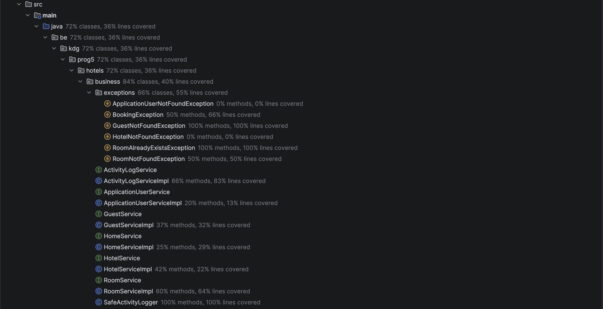
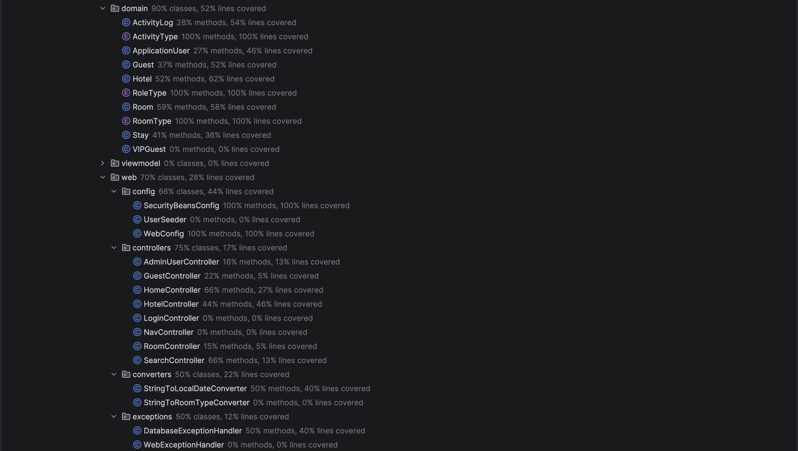
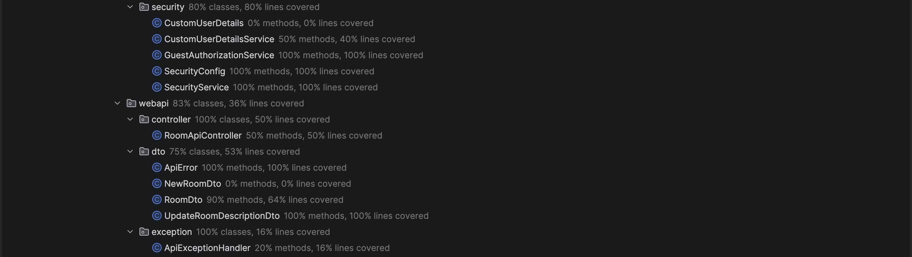
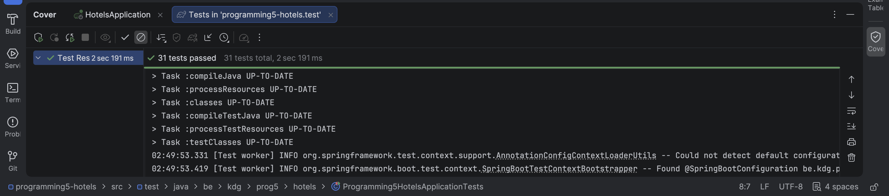
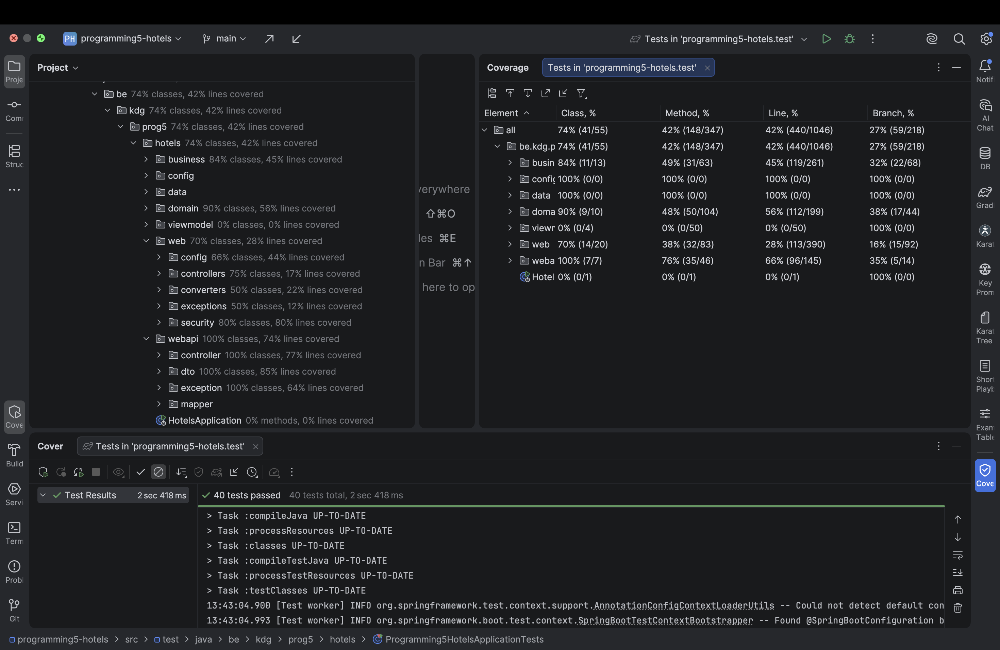
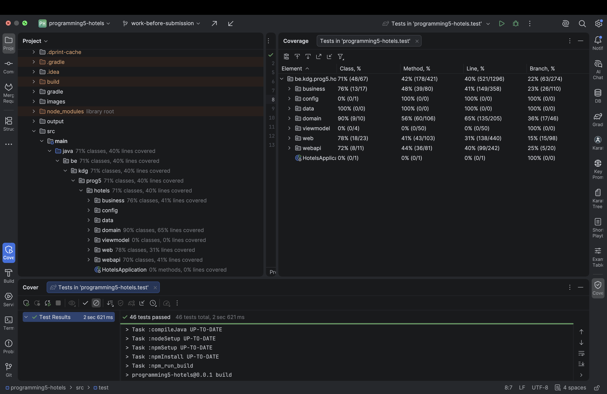

# Hotel Management System

---

## Project Description

This project is a Spring Boot application for managing hotels, rooms, guests, and stays.

The system follows:

- Layered Architecture (Controller → Service → Repository)
- Aggregate Root principles (DDD style)
- Spring Data JPA
- BigDecimal for monetary values
- Proper cascading and orphan removal for aggregates
- JPA best practices
- N+1 problems solved

---

## Final Submission Snapshot

### Main Functional Areas

- Public hotel, room, and search pages
- Hotel management with add, delete, filters, sorting, and editable descriptions
- Room management with add, delete, filtering, booking, and editable descriptions
- Guest management with regular and VIP guests
- Booking system using `Stay` as the link between `Room` and `Guest`
- Concurrent booking protection with pessimistic room locking
- User ownership for guests
- Customer registration, customer login, and customer dashboard
- Customer booking privacy: customers only see their own bookings
- Admin customer account activation/deactivation
- Admin dashboard for users, activity logs, CSV import, and current bookings
- Cached guest search with cache eviction after guest, booking, and CSV changes
- Week 10 guest REST API for the separate Client project
- Webpack/npm frontend pipeline with Bootstrap, Bootstrap Icons, Sass, Joi validation, Luxon, and Anime.js
- Spring Security with ADMIN, STAFF, and CUSTOMER access
- i18n support for English, Dutch, French, German, and Bangla

### Quick Run Commands

Start the PostgreSQL databases from the Spring backend project root:

```bash
docker compose up -d
```

Run the Spring Boot backend:

```bash
./gradlew bootRun
```

Or run the project from IntelliJ IDEA:

```text
Run HotelsApplication
```

Then open:

```text
http://localhost:8080
```

Run the Week 10 Client from the separate `Client` repository:

```bash
npm install
npm run start
```

Then open the client URL printed by webpack-dev-server:

```text
http://localhost:9000
```

### Seeded Login Accounts

| Role  | Email                          | Password   | Notes                     |
| :---- | :----------------------------- | :--------- | :------------------------ |
| ADMIN | `admin@hotelapp.com`           | `admin123` | Protected main admin      |
| STAFF | `applicationUser@hotelapp.com` | `user123`  | Normal staff account      |

Customer accounts are created from the public register page.

---

## Domain Entities

The domain model consists of the following entities:

### 1. Hotel (Aggregate Root)

- id (database ID)
- `hotelId` (business identifier: slug)
- name
- city
- country
- stars
- openedOn
- hasSpa
- imageUrl
- description
- OneToMany → Rooms

### 2. Room (Aggregate Root inside Hotel)

- id (database ID)
- number
- type
- pricePerNight (BigDecimal)
- seaView
- photoUrl
- description
- ManyToOne → Hotel
- OneToMany → Stay (cascade = ALL, orphanRemoval = true)

#### RoomType enum:

```bash
- SINGLE, DOUBLE, SUITE
```

### 3. Guest (Independent Aggregate)

- id
- fullName
- email
- dob
- avatarUrl
- discountPercentage (BigDecimal, stored on the base guest table)
- ManyToOne → ApplicationUser (owner, nullable for customer profiles)
- OneToOne → Customer (optional login account)
- OneToMany → Stay

### 4. VIPGuest (Inheritance)

- Extends Guest
- Uses the inherited discountPercentage value
- A guest is treated as VIP when discountPercentage > 0

### 5. Stay (Link Entity – Room <-> Guest)

Represents a booking.

- id
- checkInDate
- checkOutDate
- ManyToOne → Room
- ManyToOne → Guest

Business logic:

- `getNumberOfNights()`
- `getTotalPrice()`
- `getFinalPrice()` (applies discount)

### 6. ApplicationUser (Authentication & Ownership)

Represents a user that can log into the system.

- id (database ID)
- email (unique, used for login)
- password (encrypted)
- role (RoleType enum)
- OneToMany → Guests (user owns guests)

### RoleType enum:

```bash
ADMIN,
STAFF
```

### 7. Customer (Public Customer Login)

Represents a customer account that can log in and book rooms for their own profile.

- id
- password (encrypted)
- active
- OneToOne → Guest profile

Important rule:

- Customers can only view and manage their own bookings.
- Admin can activate or deactivate a customer account.
- Customers cannot change roles because they are not `ApplicationUser` staff/admin accounts.

### 8. ActivityLog (Audit / System Tracking)

Represents system activities performed by users (admin dashboard).

- id (database ID)
- action (ActivityType enum)
- description
- timestamp (LocalDateTime)
- ManyToOne → ApplicationUser (who performed the action)

### ActivityType enum:

```bash
CREATE_HOTEL,
UPDATE_HOTEL,
DELETE_HOTEL,
CREATE_ROOM,
UPDATE_ROOM,
DELETE_ROOM,
BOOK_ROOM,
DELETE_BOOKING,
CREATE_GUEST,
DELETE_GUEST,
CREATE_USER,
DELETE_USER,
UPDATE_USER_ROLE
```

---

## Architecture Overview

The application follows a layered architecture: `Controller → Service → Repository → Database`

```bash
┌─────────────────────────────┐
│        Presentation Layer   │
│      (Spring MVC + View)    │
│  Controllers + Thymeleaf UI │
└───────────────┬─────────────┘
                │
                ▼
┌─────────────────────────────┐
│        Service Layer        │
│     Business Logic & Rules  │
│   Aggregate Coordination    │
└───────────────┬─────────────┘
                │
                ▼
┌─────────────────────────────┐
│       Repository Layer      │
│      Spring Data JPA        │
│   JPQL Queries & Fetching   │
└───────────────┬─────────────┘
                │
                ▼
┌─────────────────────────────┐
│         Database            │
│        PostgreSQL           │
└─────────────────────────────┘
```

### Controller Layer

- Handles HTTP requests.
- Maps URLs to methods.
- Sends data to the view (Thymeleaf).
- Delegates all business logic to the service layer.

### Service Layer

- Contains business logic.
- Enforces domain rules.
- Coordinates aggregates.
- Ensures clean separation between web and persistence.

### Booking Service Organization

Booking use cases are handled by `BookingService` instead of `RoomService`.

Important reason:

- `RoomService` manages room CRUD, filters, and room descriptions.
- `BookingService` manages booking and cancellation use cases.
- the domain rule still remains inside `Room.addGuest(...)`.
- `Room` still owns `Stay` through cascade and orphan removal.

Important methods:

| Method                              | Purpose                                                                                     |
| :---------------------------------- | :------------------------------------------------------------------------------------------ |
| `BookingService.bookRoom(...)`      | coordinates room lookup, guest lookup, domain booking, cache eviction, and activity logging |
| `BookingService.cancelBooking(...)` | removes a stay from the owning room and logs `DELETE_BOOKING`                               |
| `Room.removeStayById(...)`          | keeps cancellation inside the Room aggregate boundary                                       |

This keeps room management and booking workflows separated while preserving the aggregate boundary around `Room` and `Stay`.

### Business Package Organization

The business layer is grouped by feature so the package does not become one big list of service files.

```bash
business.activity
business.ai
business.booking
business.customer
business.guest
business.home
business.hotel
business.room
business.security
business.user
```

Important note:

- Controllers call services.
- Services contain business rules.
- Repositories stay in the data layer.
- `SecurityService` only reads the logged-in user and roles from Spring Security.

### Repository Layer

- Responsible for database access.
- Uses Spring Data JPA.
- Contains no business logic.
- Executes JPQL queries and entity loading strategies.

### Domain Layer (Entities)

- Represents core business concepts.
- Encapsulates domain behavior.
- Aggregates follow DDD principles.
- `Room` owns `Stay` (cascade + orphan removal).
- `Guest` is an independent aggregate.

### Monetary Handling

- All money values use `BigDecimal`.
- Calculations are performed in the domain layer.
- Formatting is done **only in the view layer (Thymeleaf)**.
- No floating-point types are used for prices.

---

## Build & Run Instructions (CLI)

### 1. Requirements

Make sure the following tools are installed:

- Java 21 (or version specified in build.gradle)
- Node.js and npm
- Docker & Docker Desktop
- Git

### 2. Clone the Repository

```bash
git clone <repository-url>
cd <project-folder>
```

### 3. Start the database

The application requires a PostgreSQL database.
Use the provided docker-compose.yml file in the project root:

```bash
docker compose up -d
```

### 4. Build the project

Install frontend dependencies when cloning the project for the first time, or whenever `package.json` changes:

```bash
# macOS / Linux
./gradlew npmInstall

# Windows
gradlew.bat npmInstall
```

Use the Gradle Wrapper (included in the repository):

```bash
# macOS / Linux
./gradlew clean build

# Windows
gradlew.bat clean build
```

The Gradle `processResources` task depends on `npm_run_build`, so webpack bundles are generated automatically during a normal Gradle build. To rebuild only the frontend bundles:

```bash
# macOS / Linux
./gradlew npm_run_build

# Windows
gradlew.bat npm_run_build
```

### 5. Run the Application

```bash
# macOS / Linux
./gradlew bootRun

# Windows
gradlew.bat bootRun
```

### 6. Open in browser

After seeing:

- Started HotelsApplication

```bash
http://localhost:8080
```

---

### Notes

- The application uses Spring Data JPA.
- The database schema is generated automatically/updated by Hibernate.
- Monetary values use BigDecimal.
- Aggregate boundaries are respected.
- Room owns Stay with cascade and orphan removal.
- Guest owner is optional now because customer profiles are also stored as guests.
- Customer login uses a separate `Customer` entity connected to a `Guest` profile.
- Guest avatar URLs are normalized when blank.
- Duplicate guest emails are rejected.

---

### Features Implemented

- Hotel management (CRUD)
- Room management (CRUD + filtering)
- Guest management (CRUD + VIP logic)
- Booking system (Stay entity)
- Discount calculation
- Top-picked rooms query
- Filtering and sorting
- Add Hotel, Room, and Guest via UI
- Real-world booking home page
- Admin booking management page
- Customer registration and customer dashboard
- Customer-only booking visibility
- Admin customer active/inactive management
- Admin CSV guest import using Spring `@Async`
- Cached guest search using Spring `@Cacheable`
- Cache eviction after guest, booking, and CSV import changes
- Standalone admin dashboard cards for users, activity, imports, and bookings
- Live local weather card on the home page
- AI room assistant for natural-language room search
- Personalized AI room recommendations for logged-in customers
- Chatbot-assisted booking quote, confirmation, and cancellation flow
- Multi-language support (i18n): EN, NL, FR, DE, BN
- Thymeleaf UI with Bootstrap
- Dark/light theme

---

## Home Page Weather Feature

The home page includes a live local weather card inside the hero search section.

Purpose:

- show the visitor's current city or area beside the hotel search form
- show live temperature, condition, humidity, and wind
- let the visitor reuse the detected city in the normal hotel search field
- keep weather provider calls behind the Spring backend instead of calling them directly from the browser

Main flow:

```text
Browser geolocation -> WeatherApiController -> WeatherService -> Open-Meteo and Nominatim -> WeatherDto -> weather-widget.js
```

Important files:

| Responsibility              | File                      |
| :-------------------------- | :------------------------ |
| Weather API endpoint        | `WeatherApiController`    |
| Weather business service    | `OpenMeteoWeatherService` |
| Weather business model      | `WeatherReport`           |
| Weather API response DTO    | `WeatherDto`              |
| Weather frontend behavior   | `weather-widget.js`       |
| Home page weather markup    | `home.html`               |
| Hero and weather card style | `site.scss`               |

Implementation details:

- the browser asks for the visitor's location when the home page opens
- high accuracy location is tried first
- if precise location times out, the frontend retries with a faster approximate location
- the backend validates latitude and longitude before using external providers
- Open-Meteo provides the current weather values
- Nominatim reverse geocoding provides readable city and area names
- address lookup is optional, so weather can still be shown if reverse geocoding fails
- the `Use my location` button works as a manual refresh
- the `Search stays here` button copies the detected city into the normal search input

---

## AI Room Assistant and Recommendation Feature

The project includes an AI feature for room discovery and personalized recommendations.

This AI part is split into two sides:

- Spring Boot keeps the real hotel application rules, security, database access, and booking actions
- Python FastAPI handles text parsing, room ranking, and recommendation scoring

The AI implementation is intentionally explainable. It does not depend on a black-box LLM. It uses simple natural-language parsing for chat search and cosine similarity for recommendation ranking.

### Main AI Capabilities

- Users can ask the assistant for rooms in natural language
- The assistant can search by city, budget, room type, spa, sea view, and hotel quality
- Logged-in customers can receive room recommendations based on previous bookings
- Customers can ask the assistant to quote a booking before confirming it
- Customers can confirm or cancel bookings through protected Spring endpoints
- If the Python service is unavailable, the Spring API returns a friendly error response

### AI Architecture Flow

The browser never calls Python directly. It calls Spring first, and Spring decides what data can safely be sent to the AI service.

```text
Browser AI widget
  |
  v
Spring /api/ai endpoints
  |
  v
Spring AI business services
  |
  v
AiDataMapper creates flat AI DTOs
  |
  v
PythonAiClient sends HTTP requests
  |
  v
FastAPI hotel-ai-service on port 8001
  |
  v
Python parses text or scores rooms
  |
  v
Spring returns JSON to the browser
```

### Spring AI Files

| Responsibility | File |
| :-- | :-- |
| Chat endpoint | `AiChatApiController` |
| Recommendation endpoint | `AiRecommendationApiController` |
| Booking helper endpoints | `AiBookingApiController` |
| Chat business flow | `AiChatServiceImpl` |
| Recommendation business flow | `AiRecommendationServiceImpl` |
| Booking quote, confirm, and cancel flow | `AiBookingServiceImpl` |
| Entity to AI DTO mapping | `AiDataMapper` |
| HTTP client to Python | `PythonAiClient` |
| Auto-start Python service | `PythonAiProcessManager` |

### Frontend AI Files

The AI assistant is loaded from the shared site bundle.

| Responsibility | File |
| :-- | :-- |
| Shared site entry point | `src/main/js/site.js` |
| AI widget entry point | `src/main/js/ui/ai-room-assistant.js` |
| Chat window behavior | `src/main/js/ui/ai-assistant/chat.js` |
| API calls from the browser to Spring | `src/main/js/ui/ai-assistant/api.js` |
| Booking intent and booking actions | `src/main/js/ui/ai-assistant/booking-intent.js`, `src/main/js/ui/ai-assistant/booking.js` |
| Recommendation loading | `src/main/js/ui/ai-assistant/recommendations.js` |
| Room card rendering | `src/main/js/ui/ai-assistant/rendering.js` |
| UI styles | `src/main/scss/site.scss` |

### Python AI Service Files

The Python service is inside:

```text
hotel-ai-service
```

Important files:

| Responsibility | File |
| :-- | :-- |
| FastAPI application setup | `hotel-ai-service/app/main.py` |
| Chat API route | `hotel-ai-service/app/api/chatbot.py` |
| Recommendation API route | `hotel-ai-service/app/api/recommendations.py` |
| Chat search service | `hotel-ai-service/app/services/chatbot_service.py` |
| Recommendation service | `hotel-ai-service/app/services/recommendation_service.py` |
| Recommendation model | `hotel-ai-service/app/models/recommendation_model.py` |
| Text parser | `hotel-ai-service/app/models/text_parser.py` |
| Request and response schemas | `hotel-ai-service/app/schemas` |
| Python tests | `hotel-ai-service/tests` |

### AI API Endpoints

Spring endpoints used by the frontend:

| Endpoint | Purpose |
| :-- | :-- |
| `POST /api/ai/chat` | Sends a user message to the AI room assistant |
| `GET /api/ai/recommendations` | Gets recommendations for the current customer |
| `GET /api/ai/bookings/session` | Checks if the current user can use protected booking actions |
| `POST /api/ai/bookings/quote` | Calculates price and availability before confirmation |
| `POST /api/ai/bookings/confirm` | Creates a customer booking |
| `GET /api/ai/bookings` | Lists the current customer's bookings for cancellation |
| `POST /api/ai/bookings/cancel` | Cancels one customer-owned booking |

Python endpoints called by Spring:

| Endpoint | Purpose |
| :-- | :-- |
| `GET /health` | Checks if the Python service is running |
| `POST /ai/chat` | Parses text and ranks matching rooms |
| `POST /ai/recommendations` | Scores candidate rooms from customer booking history |

### Recommendation Model

The recommendation model uses previous bookings as the customer preference signal.

It builds a profile from:

- most common city
- most common room type
- average price per night
- average hotel stars
- spa preference
- sea view preference

Then it compares the customer profile with candidate rooms using `DictVectorizer` and cosine similarity from `scikit-learn`.

If a customer has no previous bookings, the service returns no personalized recommendations instead of showing fake personalized results.

### Chatbot Search Model

The chatbot search is rule-based and deterministic.

The parser can understand examples such as:

- `cheap room in Antwerp`
- `spa hotel`
- `suite under 600`
- `double room with sea view`
- `luxury room in Brussels`

The ranking gives points for matched filters such as city, room type, budget, spa, sea view, and stars. Some filters are strict. For example, if the user asks for Antwerp, rooms from other cities are removed.

### AI Booking Flow

The Python service does not create bookings.

Booking remains in Spring Boot because it needs:

- authenticated customer identity
- room availability checks
- customer discount calculation
- database transaction handling
- ownership and security rules

The chatbot can guide the user, but the final quote, confirm, and cancel actions are handled by Spring.

### Running the AI Service

The Spring app can auto-start the Python FastAPI service using these properties:

```properties
hotel.ai.service.base-url=http://localhost:8001
hotel.ai.service.auto-start=true
hotel.ai.service.working-directory=hotel-ai-service
hotel.ai.service.python-executable=hotel-ai-service/.venv/bin/python3
hotel.ai.service.startup-timeout-seconds=20
```

Manual Python run:

```bash
cd hotel-ai-service
python3 -m venv .venv
source .venv/bin/activate
pip install -r requirements.txt
uvicorn app.main:app --reload --port 8001
```

More detailed AI documentation is available in:

```text
hotel-ai-service/README.md
```

---

# Week 2 - REST API (Room)

## Overview

In Week 2, a robust **REST API** was implemented for the **Room** entity. The implementation strictly adheres to REST architectural principles to ensure a clean, scalable interface between the client and server.

### Key API Principles

- **Base Path:** `/api/rooms`
- **Methods:** Proper use of HTTP verbs (`GET`, `DELETE`).
- **Status Codes:** Implementation of specific response codes:
  - `200 OK`: Successful retrieval.
  - `204 No Content`: Successful deletion.
  - `404 Not Found`: Resource not found.
- **Data Format:** Standard **JSON** responses.
- **Architecture:**
  - **DTO Usage:** Implementation of `RoomDto` for decoupled data transfer.
  - **Global Exception Handling:** Managed via `@RestControllerAdvice` for consistent error structures.
- **Integration:** * Tested and verified via `rooms-api.http`.
  - Fully integrated with **JavaScript (AJAX)** to enable dynamic, asynchronous deletion without page refreshes.

---

## Controller Implementation

The API logic is encapsulated within the `RoomApiController`.

### Configuration

- **Controller Class:** `RoomApiController`
- **Base Mapping:** `@RequestMapping("/api/rooms")`

### Endpoints Implemented

| Method     | Endpoint          | Description                                 |
| :--------- | :---------------- | :------------------------------------------ |
| **GET**    | `/api/rooms`      | Retrieve a list of all rooms.               |
| **GET**    | `/api/rooms/{id}` | Retrieve details for a specific room by ID. |
| **DELETE** | `/api/rooms/{id}` | Permanently delete a room record.           |

---

### 1. GET – Retrieve All Rooms (200 OK)

This endpoint fetches the complete list of available rooms from the database, transformed into DTOs for client-side consumption.

#### HTTP Request

- **URL:** `http://localhost:8080/api/rooms`
- **Method:** `GET`
- **Accept:** `application/json`

#### Response

- **Status:** `200 OK`
- **Body:** `List<RoomDto>`

**Example Response Body:**

```json
[
  {
    "id": 1,
    "number": 101,
    "pricePerNight": 120.00,
    "hotelName": "Hilton Old Town, Antwerp"
  }
]
```

### Internal Implementation Flow

1. **Service Layer:** The controller invokes roomService.getAllRooms().
2. **Data Mapping:** Room entities are converted to RoomDto using the RoomMapper component to prevent exposing internal entity structures.
3. **Response Wrapper:** Results are wrapped in a ResponseEntity.ok(...) to ensure the correct HTTP status is sent to the client.

### 2. GET - Retrieve Single Room (200 OK)

This endpoint fetches the details of a specific room based on its unique identifier.

#### HTTP Request

- **URL:** `GET http://localhost:8080/api/rooms/1`
- **Method:** `GET`
- **Accept:** `application/json`

#### Response

- **Status:** `200 OK`
- **Body:** `RoomDto`

**Example Response Body:**

```json
{
  "id": 1,
  "number": 101,
  "pricePerNight": 120.00,
  "hotelName": "Hilton"
}
```

### Internal Implementation Flow

1. **Service Layer:** Invokes roomService.getRoomById(id) to locate the record.
2. **Data Mapping:** Uses the RoomMapper to transform the entity into a RoomDto.
3. **Response Wrapper:** Returns the mapped object via ResponseEntity.ok(...).

### 3. GET - Room Not Found (404)

This scenario occurs when a client requests a resource using an identifier that does not exist in the database.

#### HTTP Request

- **URL:** `GET http://localhost:8080/api/rooms/99999`
- **Method:** `GET`
- **Accept:** `application/json`

#### Response

- **Status:** `404 Not Found`
- **Body:** `ApiError`

**Example Response Body:**

```json
{
  "timestamp": "2026-02-28T12:30:00",
  "status": 404,
  "error": "Not Found",
  "message": "Room with id 99999 not found",
  "path": "/api/rooms/99999"
}
```

### Internal Implementation Flow

1. **Exception Trigger:** When the service layer cannot find the record, it throws a custom RoomNotFoundException.
2. **Global Catch:** The request is intercepted by the API exception handler.
3. **Class:** `ApiExceptionHandler`
4. **Annotation:** `@RestControllerAdvice`
5. **Response Wrapper:** The handler maps the exception details into a standardized ApiError object and returns it with a 404 status code.

### 4. DELETE - Delete Room (204 No Content)

This endpoint allows for the permanent removal of a room record from the system.

#### HTTP Request

- **URL:** `DELETE http://localhost:8080/api/rooms/1`
- **Method:** `DELETE`
- **Accept:** `application/json`

#### Response

- **Status:** `204 No Content`
- **Body:** _None (The response body is empty by design)._

#### Internal Implementation Flow

1. **Service Layer:** The controller calls the deletion logic, ensuring the room is removed from the database.
2. **Response Wrapper:** Instead of returning data, the controller returns `ResponseEntity.noContent().build()`.
3. **Frontend Impact:** The client receives a success confirmation (204) and can then update the UI (e.g., removing the row from a table via AJAX).

---

### 5. DELETE - Room Not Found (404)

Attempts to delete a non-existent resource are handled gracefully to inform the client of the invalid request.

#### HTTP Request

- **URL:** `DELETE http://localhost:8080/api/rooms/99999`
- **Method:** `DELETE`
- **Accept:** `application/json`

#### Response

- **Status:** `404 Not Found`
- **Body:** `ApiError` (Standardized JSON error structure).

---

## DTO & Mapping

To maintain a clean separation between the database layer and the API layer, the application utilizes the **Data Transfer Object (DTO)** pattern.

- **DTO Class:** `RoomDto`
- **Fields:** `id`, `number`, `pricePerNight`, `hotelName`
- **Mapping Framework:** MapStruct (`@Mapper(componentModel = "spring")`)
- **Custom Logic:** `@Mapping(source = "hotel.name", target = "hotelName")`

> **Note:** This approach prevents the internal `Room` entity from being exposed directly, keeping the API responses clean and specifically tailored for the frontend.

---

## Exception Handling

Centralized error management is implemented using an API exception handler to ensure consistent JSON responses for REST API requests.

- **Annotation:** `@RestControllerAdvice`
- **Target Class:** `ApiExceptionHandler`
- **Handled Exceptions:** `RoomNotFoundException`, `GuestNotFoundException`, `RoomAlreadyExistsException`, `GuestAlreadyExistsException`, validation errors, access denied errors, data conflicts, and generic API errors
- **Result:** Returns a structured JSON object (`ApiError`) containing a timestamp, status code, and descriptive message.

---

## HTTP Test File

The API was rigorously tested using the `rooms-api.http` file included in the project. This allows for rapid verification of the following scenarios:

1. **GET all rooms** - Returns `200 OK`.
2. **GET one room** - Returns `200 OK`.
3. **GET one room (Invalid ID)** - Returns `404 Not Found`.
4. **DELETE room** - Returns `204 No Content`.
5. **DELETE room (Invalid ID)** - Returns `404 Not Found`.

---

## AJAX Integration

The `DELETE` functionality is fully integrated with the frontend using the JavaScript **Fetch API**. This fulfills the requirement for dynamic UI updates without page reloads.

- **Success (204):** The room is removed from the DOM immediately.
- **Failure (404):** An error message is displayed to the user via a notification or alert.

---

## Complete HTTP Messages

For state-changing requests, first log in as an ADMIN and replace the cookie and CSRF token placeholders. The same requests are in `rooms-api.http`.

### Fetching all rooms - OK

```http
GET http://localhost:8080/api/rooms
Accept: application/json
```

```http
HTTP/1.1 200 OK
Content-Type: application/json

[{"id":1,"number":101,"pricePerNight":150.00,"hotelName":"Hotel Plaza Athénée, Paris"}]
```

### Fetching all rooms - No Content

```http
GET http://localhost:8080/api/rooms
Accept: application/json
```

```http
HTTP/1.1 204 No Content
```

### Fetching one room - OK

```http
GET http://localhost:8080/api/rooms/1
Accept: application/json
```

```http
HTTP/1.1 200 OK
Content-Type: application/json

{"id":1,"number":101,"pricePerNight":150.00,"hotelName":"Hotel Plaza Athénée, Paris"}
```

### Fetching one room - Bad Request

```http
GET http://localhost:8080/api/rooms/not-a-number
Accept: application/json
```

```http
HTTP/1.1 400 Bad Request
Content-Type: application/json
```

### Fetching one room - Not Found

```http
GET http://localhost:8080/api/rooms/99999
Accept: application/json
```

```http
HTTP/1.1 404 Not Found
Content-Type: application/json
```

### Deleting one room - No Content

```http
DELETE http://localhost:8080/api/rooms/1
Accept: application/json
Cookie: JSESSIONID={{adminSession}}
X-CSRF-TOKEN: {{csrfToken}}
```

```http
HTTP/1.1 204 No Content
```

### Deleting one room - Bad Request

```http
DELETE http://localhost:8080/api/rooms/not-a-number
Accept: application/json
Cookie: JSESSIONID={{adminSession}}
X-CSRF-TOKEN: {{csrfToken}}
```

```http
HTTP/1.1 400 Bad Request
Content-Type: application/json
```

### Deleting one room - Not Found

```http
DELETE http://localhost:8080/api/rooms/99999
Accept: application/json
Cookie: JSESSIONID={{adminSession}}
X-CSRF-TOKEN: {{csrfToken}}
```

```http
HTTP/1.1 404 Not Found
Content-Type: application/json
```

# Week 3

During week 3, two additional REST operations were implemented for the Room API. The new endpoints allow creating a room (**POST**) and updating the room description (**PATCH**).

## All endpoints were tested using the `rooms-api.http` file included in the project.

For POST and PATCH requests, use an authenticated ADMIN session and CSRF token as shown in `rooms-api.http`.

### Creating a room - Created (201)

#### Request

```http
POST http://localhost:8080/api/rooms
Content-Type: application/json
Accept: application/json
Cookie: JSESSIONID={{adminSession}}
X-CSRF-TOKEN: {{csrfToken}}

{
  "number": 501,
  "type": "DOUBLE",
  "pricePerNight": 199.99,
  "hotelId": "hilton-old-town"
}
```

### Response

```http
HTTP/1.1 201 Created
Location: /api/rooms/42
Content-Type: application/json

{"id":42,"number":501,"pricePerNight":199.99,"hotelName":"Hilton Old Town, Antwerp"}
```

### Creating a room - Bad Request (400)

#### Request

```http
POST http://localhost:8080/api/rooms
Content-Type: application/json
Accept: application/json
Cookie: JSESSIONID={{adminSession}}
X-CSRF-TOKEN: {{csrfToken}}

{
  "number": -5,
  "type": null,
  "pricePerNight": -100,
  "hotelId": null
}
```

### Response

```http
HTTP/1.1 400 Bad Request
Content-Type: application/json
```

### Creating a room - Conflict (409)

#### Request

```http
POST http://localhost:8080/api/rooms
Content-Type: application/json
Accept: application/json
Cookie: JSESSIONID={{adminSession}}
X-CSRF-TOKEN: {{csrfToken}}

{
  "number": 101,
  "type": "SINGLE",
  "pricePerNight": 150,
  "hotelId": "hilton-old-town"
}
```

### Response

```http
HTTP/1.1 409 Conflict
Content-Type: application/json
```

### Updating room description - No Content (204)

#### Request

```http
PATCH http://localhost:8080/api/rooms/1/description
Content-Type: application/json
Accept: application/json
Cookie: JSESSIONID={{adminSession}}
X-CSRF-TOKEN: {{csrfToken}}

{
  "description": "Updated modern deluxe room"
}
```

### Response

```http
HTTP/1.1 204 No Content
```

### Updating room description - Bad Request (400)

#### Request

```http
PATCH http://localhost:8080/api/rooms/1/description
Content-Type: application/json
Accept: application/json
Cookie: JSESSIONID={{adminSession}}
X-CSRF-TOKEN: {{csrfToken}}

{
  "description": ""
}
```

### Response

```http
HTTP/1.1 400 Bad Request
Content-Type: application/json
```

### Updating room description - Not Found (404)

#### Request

```http
PATCH http://localhost:8080/api/rooms/99999/description
Content-Type: application/json
Accept: application/json
Cookie: JSESSIONID={{adminSession}}
X-CSRF-TOKEN: {{csrfToken}}

{
  "description": "This room does not exist"
}
```

### Response

```http
HTTP/1.1 404 Not Found
Content-Type: application/json
```

# Week 4 - Spring Security

## Overview

In Week 4, Spring Security was integrated into the Hotels application to add authentication and authorization.

**The application now supports:**

- **User login and logout**
- **Role-based authorization**
- **Persisted users** in the database
- **Password hashing**
- A **custom login page**
- **Dynamic UI behavior** based on user status (Anonymous, Staff, or Administrator)
- **REST API & Ajax support** maintained from previous weeks

> The Hotels application now supports both hotel management staff and customer accounts.

---

## Roles used in the system

| Role          | Meaning                                           |
| :------------ | :------------------------------------------------ |
| **Anonymous** | Public visitor browsing hotels and rooms          |
| **STAFF**     | Hotel staff performing operational tasks          |
| **CUSTOMER**  | Registered customer booking their own rooms       |
| **ADMIN**     | Hotel manager with full administrative privileges |

## Authentication

A custom login page was implemented using Spring Security.

**Login URL:** `/login`

**Users authenticate using:**

- email
- password

After successful login, the user is redirected to: `/home`

The navigation bar dynamically updates to show the current login status and provides a logout option.

> **Example:** Logged in as: `applicationUser@hotelapp.com`

---

## Persisted Users

Users are implemented as a persisted entity in the database, ensuring that accounts are not lost when the application restarts.

- **Entity:** `ApplicationUser`
- **Repository:** `SpringDataApplicationUserRepository`

**The ApplicationUser entity stores:**

- `id`
- `email`
- `password` (hashed)
- `role` (ADMIN/STAFF)

This satisfies the requirement that users must be stored and managed via the database.

## Password Hashing

- Passwords are never stored in plaintext to ensure system security.
- The application utilizes **BCrypt password hashing** via Spring Security's `PasswordEncoder`.
- Passwords are salted and encoded before being persisted to the database.

---

## Default Seeded Users

To facilitate testing, a user seeding routine is implemented using `CommandLineRunner`. When the application starts, the two default users are created if they do not already exist.

| Role      | Email                          | Password   |
| :-------- | :----------------------------- | :--------- |
| **ADMIN** | `admin@hotelapp.com`           | `admin123` |
| **STAFF** | `applicationUser@hotelapp.com` | `user123`  |

> These credentials are displayed on the login page during the development phase for easier testing.

## Authorization Model

### Anonymous Users

Anonymous visitors can access public pages such as:

- `/home`
- `/hotels`
- `/rooms`
- `/hotels/{id}`
- `/rooms/{id}`
  They can browse the application but cannot perform operational tasks.

---

### STAFF (Hotel Staff)

The **STAFF** role represents hotel staff.

Staff members can perform operational tasks such as:

- view guests
- add a guest
- book a room
- access guest management pages

**Example staff pages:**

- `/guests`
- `/guests/add`
- `/rooms/{id}/book`

These operations represent normal hotel front-desk activities.

### ADMIN (Hotel Manager)

The **ADMIN** role represents a hotel administrator or manager.

Admins have all staff permissions plus management functionality.

**Admins can:**

- add a hotel
- add a room
- add guests
- book rooms
- delete hotels, rooms, and guests
- manage application users

**Admin pages include:**

- `/admin/users` - admin dashboard cards
- `/admin/users/manage` - user management
- `/admin/activity` - activity management
- `/admin/guests-csv` - asynchronous guest CSV import
- `/admin/bookings` - current bookings and cancellation
- `/hotels/add`
- `/rooms/add`

**The admin panel allows:**

- viewing all users
- creating new users
- deleting users
- switching roles (**STAFF ↔ ADMIN**)
- viewing recent activity logs
- importing guests from CSV without blocking the browser
- viewing and cancelling current bookings

> The main admin account cannot be deleted.

### Admin Dashboard Organization

The admin dashboard is a navigation hub:

```text
http://localhost:8080/admin/users
```

Dashboard cards:

| Card                | URL                   |
| :------------------ | :-------------------- |
| User Management     | `/admin/users/manage` |
| Activity Management | `/admin/activity`     |
| Add User            | `/admin/users/add`    |
| Import Guests       | `/admin/guests-csv`   |
| Bookings            | `/admin/bookings`     |

Each management area has its own page:

- `admin-users.html` is the dashboard card page
- `admin-users-manage.html` contains the user table and user modals
- `admin-activity.html` contains the activity log table
- `admin-bookings.html` contains current bookings and cancellation
- `admin-guests-csv.html` contains the CSV upload form

### Admin Booking Page

Admins can view and cancel current bookings from:

```text
http://localhost:8080/admin/bookings
```

The page shows:

- guest name and email
- room number and room type
- hotel name and location
- check-in and check-out dates
- total price and final price
- cancel booking button

Cancellation behavior:

- the cancel form sends `POST /admin/bookings/{stayId}/cancel`
- CSRF token is included in the modal form
- the booking is removed through `BookingService.cancelBooking(...)`
- `DELETE_BOOKING` is written to Activity Management
- guest search cache is evicted

### Different Behavior for Logged-In Users

The application shows different functionality depending on the authentication state.

**Anonymous visitors**

- can browse hotels and rooms

**Staff users**

- can manage guests
- can book rooms

**Admin users**

- can manage hotels, rooms, and users
  This ensures authenticated users see more application-specific functionality than anonymous visitors.

---

### REST API Compatibility

The REST API implemented in previous weeks continues to work seamlessly with the new security layer.

**Examples:**

- `GET /api/rooms`
- `POST /api/rooms`
- `PATCH /api/rooms/{id}/description`
- `DELETE /api/rooms/{id}`

**Security rules applied:**

| Method / route         | Access                            |
| :--------------------- | :-------------------------------- |
| **GET** `/api/**`      | public                            |
| **POST** `/api/rooms`  | authenticated                     |
| **POST** `/api/guests` | public for the Week 10 client use |
| **PATCH** `/api/**`    | authenticated                     |
| **DELETE** `/api/**`   | authenticated                     |

> **CSRF protection** is enabled. The only CSRF exception is `POST /api/guests`, because that endpoint is used by the separate Week 10 client project.

## Example Links

### Public Page

Accessible without authentication:
[http://localhost:8080/home](http://localhost:8080/home)

### Page requiring authentication

**Example staff page:**
[http://localhost:8080/guests/add](http://localhost:8080/guests/add)

**Example admin page:**
[http://localhost:8080/admin/users](http://localhost:8080/admin/users)

## Summary

Week 4 introduced a complete **Spring Security** setup into the Hotels application.

**The implementation includes:**

- custom login page
- persisted users
- **BCrypt** password hashing
- default seeded users
- role-based authorization
- staff operations (add guest, book room)
- admin operations (manage hotels, rooms, users)
- continued REST API and Ajax functionality

This creates a realistic security model for a hotel management system where **anonymous visitors**, **staff users**, and **administrators** have different levels of access.

## Week 5 - Security & Authorization

In Week 5, Spring Security was implemented to secure the Hotel Booking application.

The main goal was to introduce:

- authentication (login system)
- role-based authorization (STAFF / ADMIN / CUSTOMER)
- ownership-based access control (users linked to their own data)
- CSRF protection for secure requests

---

## Seeded Users

The application seeds the following users automatically:

| Email                        | Password | Role              |
| ---------------------------- | -------- | ----------------- |
| admin@hotelapp.com           | admin123 | ADMIN (PROTECTED) |
| applicationUser@hotelapp.com | user123  | STAFF             |

Passwords are stored securely using **BCrypt hashing**.

---

## Roles in the Application

There are three types of users:

---

### 1. Unauthenticated Users (Anonymous)

Users who are not logged in.

**Can:**

- View home page
- View hotels
- View rooms

**Cannot:**

- Create guests
- Delete guests
- Access admin or staff features

Example: http://localhost:8080/home

---

### 2. STAFF Role

Represents staff users of the system.

**Can:**

- View guests
- Create new guests
- View guest details
- Interact with the system (rooms, bookings, etc.)

**Ownership rule:**

- When a STAFF user creates a guest -> that guest is linked to that staff user
- STAFF can **only delete their own guests**

Example: http://localhost:8080/guests/add

---

### 3. ADMIN Role

Administrators have full access.

**Can:**

- Manage hotels
- Manage rooms
- Manage guests
- Manage users
- Activate or deactivate customer accounts
- Delete any guest (even if not owner)
- Switch between STAFF and ADMIN roles
- Use Admin Dashboard cards to open user management, activity, add user, import guests, and bookings

Example: http://localhost:8080/admin/users

---

## User–Guest Association

Guests created by staff are linked to a user (owner).

Customer profiles are also stored as guests, but those profiles do not need a staff owner.

Relationship:
ApplicationUser (1) –– (many) Guest

When a guest is created:

- the logged-in staff user becomes the owner
- customer profile guests can exist without a staff owner
- ownership is enforced during guest deletion

**Access rules:**

- Owner -> can delete their own guests
- ADMIN -> can delete all guests
- Other staff users → cannot delete guests they do not own

---

## UI Access Control

The UI hides actions that users are not allowed to perform.

Examples:

- "Add Guest" button hidden for anonymous users
- Admin menu visible only to ADMIN
- Delete button shown only for:
  - owner
  - ADMIN

Important: UI hiding is not enough -> backend also validates.

---

## Server-Side Authorization

All security rules are enforced in the backend using Spring Security.

Examples:

- `/admin/**` -> ADMIN only
- `/api/**` (POST, PATCH, DELETE) -> authenticated users, except `POST /api/guests` for the Week 10 client
- Ownership checks enforced in service layer

This prevents users from bypassing restrictions using tools like Postman.

---

## REST API Security

The REST API continues to work with security rules:

- `GET /api/**` -> public
- `POST /api/**` -> authenticated, except `POST /api/guests` for the Week 10 client
- `PATCH /api/**` -> authenticated
- `DELETE /api/**` -> authenticated

Example protected endpoint:
POST /api/rooms

---

## CSRF Protection

CSRF protection is **enabled** using Spring Security (default behavior).

Implementation includes:

- CSRF token in HTML meta tags
- Token added to all AJAX requests via headers
- Shared `src/main/js/utils/csrf.js` helper for reuse

This ensures:

- Only valid requests from the application are accepted
- External/malicious requests are blocked

The exception is `POST /api/guests`, which ignores CSRF because it is called from the separate Week 10 client.

---

## Consistency of Security Model

The system follows consistent security rules:

- Anonymous users -> read-only access
- Authenticated users -> can create data
- Users -> can only delete guests they own
- Admin -> full control

This matches real-world application behavior and assignment requirements.

---

## Summary

Week 5 introduces a complete and secure system:

- Authentication with Spring Security
- Role-based access (STAFF / ADMIN / CUSTOMER)
- Ownership-based authorization
- Protected REST API with one Week 10 client exception
- CSRF protection for state-changing requests, except `POST /api/guests`
- UI + backend validation

This results in a realistic hotel management system where:

- staff users manage their own guest data
- customers manage only their own bookings
- administrators manage the entire system securely

---

# Week 6 - Testing

## Overview

In this week, I implemented tests for both the repository layer and the service layer.

The goal was to:

- **Verify database constraints and mappings**
- **Validate business logic** in the service layer
- **Ensure tests are isolated** and reproducible
- **Follow testing best practices** (Arrange–Act–Assert, multiple scenarios)

---

## Test Configuration (Spring Profile)

All tests run with a separate profile:
`@ActiveProfiles("test")`

**This ensures:**

- Tests use a separate environment
- Tests connect to a separate PostgreSQL test database: `hotels_test`
- No interference with development or production data
- The normal application seeder does not run during tests because `UserSeeder` is disabled for the `test` profile

## Test Data Setup Strategy

In every test class, I used:
`@BeforeEach`

### What happens in setup:

**All repositories are cleaned:**

- `repository.deleteAll();`

**Required entities are created manually:**

- `ApplicationUser` (needed when the test guest is staff-owned)
- `Hotel`
- `Guest` (when needed)

**Why this is important:**

- **Each test starts with a clean database:** Prevents data leaking from previous runs.
- **Tests are independent:** A failure in one test does not affect the others.
- **No hidden dependencies:** All state is explicitly defined within the setup method.

---

## Repository Layer Tests

### 1. GuestRepository Tests

**What was tested:**

#### Delete operations

- `deleteById()` removes a guest correctly
- `deleteAll()` clears the table

#### Validation constraints

1. **Email cannot be null**

- `ConstraintViolationException` → Bean Validation (Hibernate Validator)

2. **Email must be unique**

- `DataIntegrityViolationException` → Database constraint

3. **Owner is required (NOT NULL FK)**

- `DataIntegrityViolationException`

**Important understanding:**

| Type            | Where enforced   |
| :-------------- | :--------------- |
| **@NotNull**    | Validation layer |
| **UNIQUE / FK** | Database         |

### 2. RoomRepository Tests

**What was tested:**

#### Aggregate behavior

**Room → Stay (cascade + orphanRemoval)**

- Deleting a `Room` automatically deletes all related `Stay` entities.
- `roomRepository.deleteById(roomId);`

**Ensures:**

- No orphan records in the database.
- Correct aggregate design and data consistency.

#### Unique constraint

**Same room number in same hotel → NOT allowed**

- `DataIntegrityViolationException`

**Enforced by database** (not Hibernate) to prevent duplicate room entries within a single hotel.

#### Lazy loading (performance)

**`Room.stays` is LAZY**

- `entityManagerFactory.getPersistenceUnitUtil().isLoaded(foundRoom, "stays") == false`

**Prevents unnecessary queries** by ensuring related stays are only loaded when explicitly accessed.

#### Lazy loading

**`Stay.guest` is LAZY**

- `Stay` keeps its `Guest` relationship lazy by default in the domain model.

Specific repository queries use `JOIN FETCH` when the page needs guest data immediately, avoiding accidental N+1 queries while keeping the default mapping efficient.

---

## Service Layer Tests (Integration Tests)

### Configuration

`@SpringBootTest`
`@ActiveProfiles("test")`

**These are integration tests, not unit tests:**

- Use a **real PostgreSQL test database**
- Use **real repositories**
- Test the **full flow** (Service → Repository → DB)

---

### Tested Service: `RoomService`

#### 1. `createRoom()`

- **Success** → room created and linked to hotel
- **Duplicate** → `RoomAlreadyExistsException`

#### 2. `getRoomById()`

- Returns correct room
- Throws `RoomNotFoundException`

#### 3. `deleteRoom()`

- Room removed from database

#### 4. `updateRoomDescription()`

- Uses **JPA dirty checking** (no explicit `.save()` needed)

#### 5. `bookRoom()` (Aggregate logic)

- Creates a `Stay` (`Room` acts as the aggregate root)
- Guest not found → `GuestNotFoundException`
- Room not found → `RoomNotFoundException`

#### 6. `findRooms()` (Filtering)

- Uses **Optional** parameters:
  - `Optional<RoomType>`
  - `Optional<Boolean>`
  - `Optional<BigDecimal>`
- **Allows flexible queries** without tedious null checks.

---

### Important Fix (Logging + Security)

**Problem:**

- Services rely on the **logged-in user** for activity logging.
- Tests run in a background context with **no authentication**, causing null pointer exceptions or test failures.

**Solution:**

- Created a safe retrieval method:
  `securityService.getLoggedInUserSafe()`

- Centralized the null-safe activity logging in `SafeActivityLogger`:

```
safeActivityLogger.log(ActivityType.UPDATE_ROOM, "Updated room description");
```

### Result:

- **Tests run without authentication**
- **Logging still works** in the real application
- **Business logic is independent** of security context

---

### How to Run Tests

**From terminal:**

```bash
docker compose up -d postgres_hotels_test_db
./gradlew test
```

**Or via IntelliJ:**

- Start the `postgres_hotels_test_db` Docker container first
- Right click → Run Tests

---

### What Makes These Tests Good

These tests follow testing best practices:

- **Independent:** A clean database is ensured for each test run.
- **Repeatable:** Results are consistent across different environments.
- **Clear AAA structure:** Every test follows the **Arrange–Act–Assert** pattern.
- **Comprehensive:** Both success and failure scenarios are covered.
- **Realistic:** They validate actual database behavior, including constraints and mappings.
- **Logic-focused:** They verify the core business logic within the service layer.

---

**Chosen because:**

- Service logic is heavily dependent on data persistence.
- It provides more realistic testing of how the application functions in production.

---

### Summary of Week 6:

In this week, I implemented a robust testing suite that ensures the reliability of the core application layers:

- **Repository tests** for validating database constraints, entity mappings, and specific loading behaviors (Lazy vs. Eager).
- **Service integration tests** to verify complex business logic and aggregate roots.
- **Proper test isolation** using dedicated Spring profiles (`@ActiveProfiles("test")`) to keep environments separate.
- **PostgreSQL test database** setup so tests do not touch development or production data.
- **Safe activity logging** through `SafeActivityLogger`, allowing business logic to function even when no security context or authenticated user is present.
- **Result:** A reliable and realistic testing setup aligned with industry best practices. ###

---

# Week 8 - Controller Testing & Security Verification

## Overview

In this week, I implemented integration tests for the presentation layer and security authorization rules.

The goal was to:

- **Verify MVC controllers** return the correct Thymeleaf views and model attributes
- **Verify REST API controllers** return correct HTTP status codes
- **Test Spring Security with security filters enabled**
- **Verify owner/admin authorization rules**
- **Run all tests with the `test` profile and a separate PostgreSQL test database**
- **Keep all tests executable with one command**

---

## Test Configuration

All Week 8 tests use the test profile:

```java
@ActiveProfiles("test")
```

The controller tests also use:

```java
@SpringBootTest
@AutoConfigureMockMvc
```

**This means:**

- The full Spring context is loaded.
- Spring Security filters are active during tests.
- Tests use the separate PostgreSQL database `hotels_test`.
- The normal application seed data does not interfere with test data.
- Tests behave closer to the real application than simple unit tests.

---

## Why MockMvc Was Used

`MockMvc` allows controller testing without starting a real web server.

I used it to:

- Send HTTP requests such as `GET` and `PATCH`
- Add query parameters and path variables
- Send JSON request bodies
- Simulate authenticated users with roles
- Add CSRF tokens for modifying requests
- Verify HTTP status codes
- Verify returned view names
- Verify model attributes

---

## MVC Integration Tests

### Test Class

`HotelControllerMvcTest`

### Purpose

This class tests the MVC part of the presentation layer.
It verifies that `HotelController` returns the correct Thymeleaf pages and places the expected data in the model.

### Tested Scenarios

#### 1. Hotels overview page

```http
GET /hotels
```

**Verified:**

- HTTP `200 OK`
- View name is `hotels`
- Model contains `hotels`
- Model contains `total`

#### 2. Search hotels by name

```http
GET /hotels?name=Grand
```

**Verified:**

- HTTP `200 OK`
- View name is `hotels`
- Model contains the filtered `hotels` attribute

#### 3. Hotel detail page

```http
GET /hotels/{hotelId}
```

**Verified:**

- HTTP `200 OK`
- View name is `hotel-detail`
- Model contains `hotel`
- Model contains `rooms`
- Model contains `guestsPerRoom`
- Model contains `totalGuests`

---

## API Integration Tests

### Test Class

`RoomApiControllerTest`

### Purpose

This class tests the REST API part of the presentation layer.
It verifies that `RoomApiController` returns the correct HTTP responses and respects Spring Security rules.

### Test Data Strategy

For the API tests I used SQL scripts:

```java
@Sql(scripts = "/sql/room-api-test-data.sql", executionPhase = Sql.ExecutionPhase.BEFORE_TEST_METHOD)
@Sql(scripts = "/sql/cleanup.sql", executionPhase = Sql.ExecutionPhase.AFTER_TEST_METHOD)
```

**Why this is useful:**

- Every API test starts with known data.
- The database is cleaned after every test.
- Tests are repeatable and independent.
- There are no hidden dependencies on development seed data.

### Tested Scenarios

#### 1. Get all rooms

```http
GET /api/rooms
```

**Verified:**

- HTTP `200 OK`

#### 2. Admin updates room description

```http
PATCH /api/rooms/1/description
```

**Security setup:**

```java
@WithMockUser(roles = "ADMIN")
```

**Verified:**

- HTTP `204 No Content`

#### 3. Staff user cannot update room description

```http
PATCH /api/rooms/1/description
```

**Security setup:**

```java
@WithMockUser(roles = "STAFF")
```

**Verified:**

- HTTP `403 Forbidden`

---

## CSRF Protection

Spring Security is enabled during tests.
Therefore, state-changing requests such as `PATCH`, `POST`, and `DELETE` require a CSRF token.

For the `PATCH` API tests I used:

```java
.with(csrf())
```

This is important because the test should fail or pass because of authorization, not because of a missing CSRF token.

---

## Role Verification Tests

### Test Class

`SecurityAuthorizationTest`

### Purpose

This class tests the owner/admin authorization rule for deleting guests.

The authorization is implemented in the service layer with:

```java
@PreAuthorize("@guestAuthorizationService.canDeleteGuest(#guestId, authentication)")
```

Because the security rule is on the service method, the test also calls the service method directly.
This matches the Week 8 instruction: if authorization is implemented in the service layer with `@PreAuthorize`, it must be tested on the service.

### Tested Scenarios

#### 1. Owner may delete own guest

**Verified:**

- Delete succeeds
- Guest is removed from the database

#### 2. Other staff user may not delete guest

**Verified:**

- `AccessDeniedException`
- Guest still exists in the database

#### 3. Admin may delete any guest

**Verified:**

- Delete succeeds
- Guest is removed from the database

#### 4. Anonymous user may not delete guest

**Verified:**

- `AccessDeniedException`
- Guest still exists in the database

---

## How To Run All Tests

Start the PostgreSQL test database:

```bash
docker compose up -d postgres_hotels_test_db
```

Then run all tests:

```bash
./gradlew test
```

This runs repository tests, service tests, MVC integration tests, API integration tests, and security authorization tests together.

---

## Code Coverage

The following screenshots show IntelliJ IDEA coverage results after executing all tests:

<p align="center">

</p>

<p align="center">

</p>

<p align="center">

</p>

<p align="center">

</p>

---

## Test Classes Required By Week 8

| Requirement             | Test class                  |
| :---------------------- | :-------------------------- |
| MVC integration tests   | `HotelControllerMvcTest`    |
| API integration tests   | `RoomApiControllerTest`     |
| Role verification tests | `SecurityAuthorizationTest` |

---

## What Makes These Tests Good

These tests follow testing best practices:

- **Independent:** Test data is cleaned and recreated for predictable results.
- **Repeatable:** Tests can run many times with the same outcome.
- **Clear:** Test method names describe the expected behavior.
- **Realistic:** Tests load the Spring context and use a real PostgreSQL test database.
- **Security-aware:** Spring Security is enabled and CSRF is included where needed.
- **Complete scenarios:** Both allowed and forbidden actions are tested.
- **Single command:** All tests run together using `./gradlew test`.

---

## Summary of Week 8

In this week, I added presentation-layer and security-focused integration tests:

- MVC tests for Thymeleaf hotel pages.
- REST API tests for room endpoints.
- Security tests for owner/admin guest deletion.
- SQL-based API test setup and cleanup.
- PostgreSQL test database with the `test` profile.
- CSRF-aware tests for modifying requests.

**Result:** A realistic Week 8 testing setup that verifies controller behavior, API behavior, and Spring Security authorization rules without touching development or production data.

---

# Week 9 - Unit Testing With Mocking & Continuous Integration

## Overview

In this week, I added mock-based unit tests and a GitLab CI pipeline.

The goal was to:

- **Unit test one REST API endpoint** with mocked controller dependencies
- **Unit test business-layer methods** with mocked repositories and logging
- **Use `verify`** to prove that important dependency methods are called with the correct arguments
- **Keep all tests executable with one command**
- **Run build and test automatically in GitLab CI**
- **Run CI tests against a PostgreSQL service**
- **Publish a JUnit test report in the pipeline**

---

## Mocking Tests

### API Unit Test Class

`RoomApiControllerUnitTest`

### Tested Endpoint

```http
POST /api/rooms
```

This endpoint was chosen because it has meaningful behavior:

- It validates request data.
- It converts a DTO to a domain object.
- It calls the service layer.
- It converts the saved entity back to a DTO.
- It can return different HTTP responses.

### Mocked Dependencies

In this test class, the controller is real, but its dependencies are mocked:

- `RoomService`
- `RoomMapper`

### Tested Scenarios

- Valid request returns `201 Created`
- Missing required field returns `400 Bad Request`
- Duplicate room number returns `409 Conflict`

---

## Business Layer Unit Tests

### Test Class

`RoomServiceUnitTest`

### Tested Service Methods

#### 1. `createRoom(...)`

**Tested scenarios:**

- Room is created successfully
- Duplicate room number throws `RoomAlreadyExistsException`
- Missing hotel throws `IllegalArgumentException`

#### 2. `searchAvailableRooms(...)`

**Tested scenarios:**

- Query is cleaned and repository filtering is called
- Invalid date range is rejected before repository access
- Rooms with overlapping stays are filtered out

### Mocked Dependencies

The service is tested with mocked dependencies:

- `SpringDataRoomRepository`
- `SpringDataHotelRepository`
- `SpringDataGuestRepository`
- `SafeActivityLogger`

---

## Verify Tests

The Week 9 tests use `verify` to check interactions with mocked dependencies.

Examples:

- `RoomApiControllerUnitTest` verifies that `roomService.createRoom(...)` is called with the expected room and hotel id.
- `RoomServiceUnitTest` verifies that `roomRepo.searchRooms(...)` receives the cleaned query.
- `RoomServiceUnitTest` verifies that activity logging is called after successful room creation.

## Code Coverage after Week 9

The following screenshot shows IntelliJ IDEA coverage results after executing all tests:

<p align="center">

</p>

---

## Continuous Integration

### CI File

`.gitlab-ci.yml`

### Pipeline Stages

The pipeline has two stages:

| Stage   | Purpose                                                   |
| :------ | :-------------------------------------------------------- |
| `build` | Compiles and builds the application without running tests |
| `test`  | Runs all tests and publishes the JUnit report             |

### PostgreSQL Service In CI

The test stage starts a PostgreSQL service:

```yaml
services:
  - name: postgres:18.1-alpine
    alias: postgres
```

Inside the pipeline, tests connect to:

```properties
jdbc:postgresql://postgres:5432/hotels_test
```

Locally, tests still use the Docker Compose test database:

```properties
jdbc:postgresql://localhost:5051/hotels_test
```

---

## CI Cache And Reports

The pipeline caches Gradle files:

- `.gradle/caches/`
- `.gradle/wrapper/`
- `build/`

The test stage publishes the JUnit report from:

```text
build/test-results/test/TEST-*.xml
```

## How To Run All Tests

Start the PostgreSQL test database:

```bash
docker compose up -d postgres_hotels_test_db
```

Run all tests:

```bash
./gradlew test
```

This runs repository tests, service integration tests, controller integration tests, security tests, and Week 9 unit tests together.

---

## Test Classes Required By Week 9

| Requirement                        | Test class                                         |
| :--------------------------------- | :------------------------------------------------- |
| Mocking tests for web API endpoint | `RoomApiControllerUnitTest`                        |
| Mocking tests for business layer   | `RoomServiceUnitTest`                              |
| Tests using `verify`               | `RoomApiControllerUnitTest`, `RoomServiceUnitTest` |

---

## Summary of Week 9

In this week, I added unit tests with mocks and continuous integration:

- API unit tests for `POST /api/rooms`
- Business-layer unit tests for room creation and room availability search
- Mockito `verify` checks for important method calls
- GitLab CI with separate build and test stages
- PostgreSQL service for CI tests
- JUnit test report publishing in GitLab

**Result:** The project now has both realistic integration tests and focused unit tests, and all tests can run locally or in GitLab CI with PostgreSQL.

---
## Latest Code Coverage

The following screenshot shows IntelliJ IDEA coverage results after executing all tests:
<p align="center">

</p>
---

# Week 10 - Separate Client REST Integration

## Overview

In Week 10, a separate frontend client was connected to the Spring Boot backend through REST endpoints.

The backend supports this client through:

- `GET /api/guests`
- `GET /api/guests/{id}`
- `POST /api/guests`

The client can search guests, view guest data, and create a guest using JSON instead of Thymeleaf form submission.

## Guest API Support

The guest API is implemented in `GuestApiController`.

| Endpoint            | Purpose                         | Access                            |
| :------------------ | :------------------------------ | :-------------------------------- |
| `GET /api/guests`   | Search guests by name or email  | Public                            |
| `GET /api/guests/1` | Retrieve one guest              | Public                            |
| `POST /api/guests`  | Create a guest from JSON client | Public for the Week 10 client use |

`POST /api/guests` creates a guest without a room booking. Client-created guests are assigned to the protected admin account.

Final client behavior:

- successful guest creation returns `201 Created`
- duplicate email returns `409 Conflict`
- validation errors return `400 Bad Request`
- blank or whitespace avatar URLs are saved as `/images/guests/guest.jpg`
- public client-created guests are saved with `discountPercentage = 0`

## Security Note

CSRF protection remains enabled for the application. The only ignored CSRF route is:

```http
POST /api/guests
```

This exception exists because the Week 10 client is separate from the Thymeleaf application and cannot use the normal server-rendered CSRF meta tags.

---

# Week 11 - Embedded Frontend With npm and webpack

The frontend is embedded in this Spring Boot repository using a Gradle integration flow.

## Frontend Build Setup

- `package.json` is in the project root and uses `"type": "module"`.
- Webpack reads page entry files from `src/main/js`.
- Reusable JavaScript is placed in subdirectories such as `src/main/js/api`, `src/main/js/ui`, `src/main/js/utils`, `src/main/js/validation`, and `src/main/js/animations`.
- SCSS source files live in `src/main/scss`.
- Generated bundles are written to `src/main/resources/static/js`, `src/main/resources/static/css`, and `src/main/resources/static/fonts`.
- Generated frontend output and `node_modules` are ignored by Git.

## SCSS and Bootstrap

Existing CSS was migrated into SCSS. The project uses Sass variables, mixins, and nesting in:

- `src/main/scss/_variables.scss`
- `src/main/scss/_mixins.scss`
- `src/main/scss/site.scss`

Bootstrap is customized through Sass in `src/main/scss/site.scss`, where project colors, radius values, and the base font are set before importing Bootstrap. Bootstrap Icons are also imported from npm in the same SCSS entry.

## Week 11 Required Evidence

### Bootstrap Icon

| Icon                  | URL                                | Source file                                   |
| :-------------------- | :--------------------------------- | :-------------------------------------------- |
| `bi-person-plus-fill` | `http://localhost:8080/guests/add` | `src/main/resources/templates/add-guest.html` |

The icon is available through the npm package `bootstrap-icons` and is bundled from `src/main/scss/site.scss`.

### Custom Client-side Form Validation

| Form           | URL                                | Source file                                  |
| :------------- | :--------------------------------- | :------------------------------------------- |
| Add Guest form | `http://localhost:8080/guests/add` | `src/main/js/validation/guest-validation.js` |

The Add Guest form uses custom JavaScript validation with the `joi` npm package. It validates the guest name, email, date of birth, avatar URL, discount percentage, and optional room booking dates before the form is submitted.

### Additional JavaScript Dependencies

| Dependency | URL                                             | Source file                                                                           | User action                                                                 |
| :--------- | :---------------------------------------------- | :------------------------------------------------------------------------------------ | :-------------------------------------------------------------------------- |
| `animejs`  | `http://localhost:8080/rooms/{id}?created=true` | `src/main/js/animations/toast-animation.js` and `src/main/js/ui/room-create-toast.js` | Create a room. The success toast on the room detail page is animated.       |
| `luxon`    | `http://localhost:8080/guests/add`              | `src/main/js/utils/date-format.js` and `src/main/js/validation/guest-validation.js`   | Submit invalid guest or booking dates. Luxon parses and compares the dates. |

## Frontend Quality Tools

Run JavaScript linting:

```bash
npm run lint
```

Check dprint formatting:

```bash
npm run format
```

Apply dprint formatting:

```bash
npm run format:fix
```

Build webpack bundles directly:

```bash
npm run build
```

---

# Week 12 - File Uploads, Async Processing, and Caching

Week 12 focuses on file uploads, asynchronous processing, and caching.

## Asynchronous CSV Guest Import

Admins can upload a CSV file from:

```text
http://localhost:8080/admin/guests-csv
```

The upload page is admin-only and uses a normal Spring MVC form with `MultipartFile`.

Important classes:

| Responsibility           | File                                   |
| :----------------------- | :------------------------------------- |
| Upload controller        | `AdminGuestCsvController`              |
| Async CSV processing     | `GuestCsvImportService`                |
| Async and caching config | `ApplicationConfig`                    |
| Sample CSV               | `src/main/resources/sample-guests.csv` |

CSV format:

```csv
fullName,email,dob,avatarUrl,discountPercentage
Seleny Lees,seleny.lees@example.com,1991-04-12,/images/guests/guest.jpg,0
Arixon Ben,arixon.ben@example.com,1988-11-03,/images/guests/guest.jpg,15
```

Implementation details:

- `AdminGuestCsvController.uploadGuestsCsv(...)` receives the file and immediately calls the import service
- `GuestCsvImportService.importGuests(...)` is annotated with `@Async`
- the CSV parsing and database inserts happen on a different thread
- the browser receives a response as soon as processing starts
- duplicate guest emails are skipped using `existsByEmailIgnoreCase`
- imported guests are assigned to the admin who uploaded the CSV
- positive discount values create a `VIPGuest`
- public customer profiles are regular guests connected to a `Customer` login account
- import completion is logged in Activity Management

This satisfies the requirement that the browser must not wait until all CSV rows are processed.

## Cached Guest Search

Guest search is cached in:

```text
GuestServiceImpl.searchGuests(...)
```

Important files:

| Responsibility                          | File                                          |
| :-------------------------------------- | :-------------------------------------------- |
| Cache enablement                        | `ApplicationConfig`                           |
| Cached service method                   | `GuestServiceImpl.searchGuests(...)`          |
| Search query                            | `SpringDataGuestRepository.searchGuests(...)` |
| Cache eviction on guest create/delete   | `GuestServiceImpl`                            |
| Cache eviction on booking create/cancel | `BookingServiceImpl`                          |

Cache behavior:

- cache name is `guestSearch`
- cache key uses the cleaned search term and cleaned minimum room count
- repeated searches with the same values reuse cached results
- creating a guest evicts the cache
- deleting a guest evicts the cache
- booking a room evicts the cache because guest stay counts can change
- cancelling a booking evicts the cache for the same reason
- CSV import evicts the cache before and after processing

This satisfies the requirement that the same search term should not hit the database twice unless related data changes.

---

> <h2 align="center"> Author: <span style="color:#9d0dfd;"><em>Tanmoy Das</em></span> </h2>

<p align="center">
  <i>Bachelor of Applied Computer Science</i>
</p>
